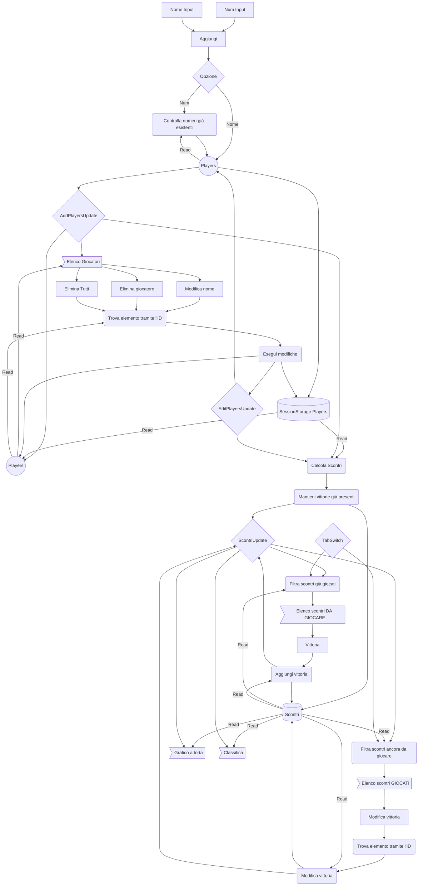
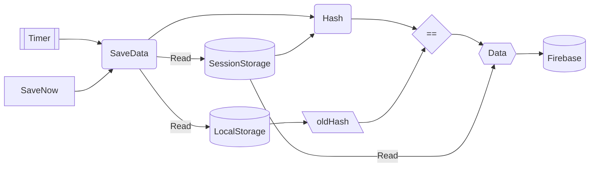

# Campionati IIS Falcone-Righi
Applicazione sviluppata in react Vite che serve a gestire i campionati scolastici (specialmente di ping pong) nel nostro istituto. Ho reso il codice open source perchè non penso di mantenere questa webapp per molto quindi aprendo il codice chi ha voglia può apportare eventuali modifiche richieste dai professori.

## Struttura dello Storage

### Salvataggio

